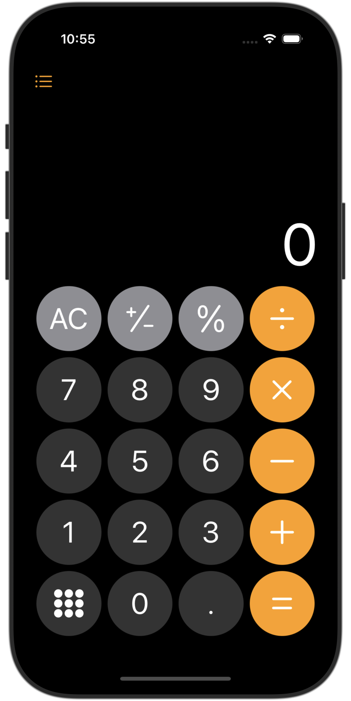
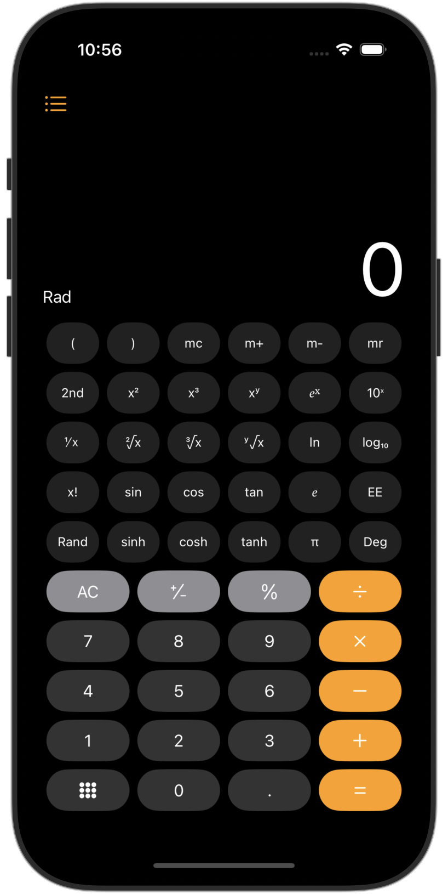
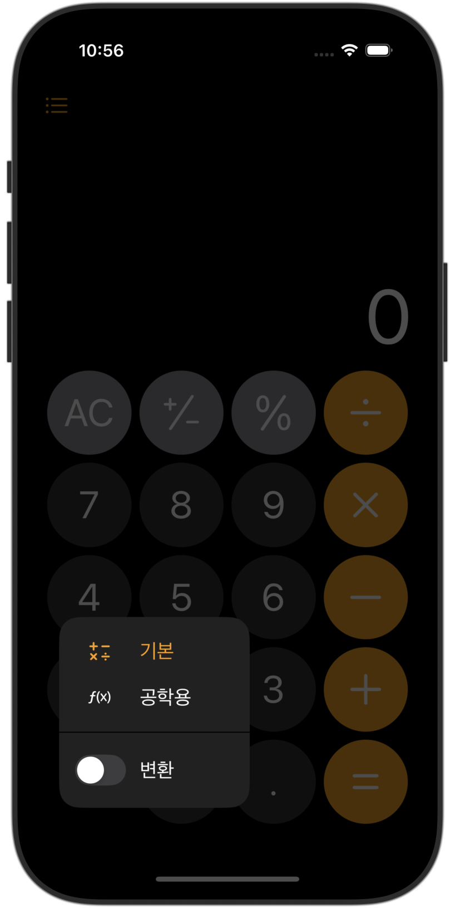

# SwiftUI_Calculator
SwiftUI로 애플 기본 계산기 앱을 구현

## 프로젝트 소개
- iOS 18에 기본 탑재된 계산기 앱을 SwiftUI로 프론트엔드, Swift로 백엔드를 구현

- **사용된 패턴**
    - MVVM + MVC

- **최소 iOS 버전**
    - iOS 16

## 특징
- UserDefaults를 사용하여 인앱 메모리에 연산 기록을 저장하고, RxSwift를 활용하여 변화 감지 후 비동기적으로 View에 반영  
- RxSwift를 사용하여 비동기적으로 디바이스의 Orientation을 감지하고 UI에 적용  
- Stack 자료구조를 이용하여 연산자 우선순위 구현  

## 앱 화면
<table>
  <tr>
    <td align="center" width="200">
      
      
<strong>일반 모드</strong>

    </td>
    <td align="center" width="200">
      
      
<strong>공학 모드</strong>

    </td>
  </tr>
  <tr>
    <td align="center" width="200">
      
      
<strong>모드 선택</strong>

    </td>
    <td align="center" width="200">
      
      
<strong>기록 열람 및 선택</strong>

    </td>
  </tr>
</table>
