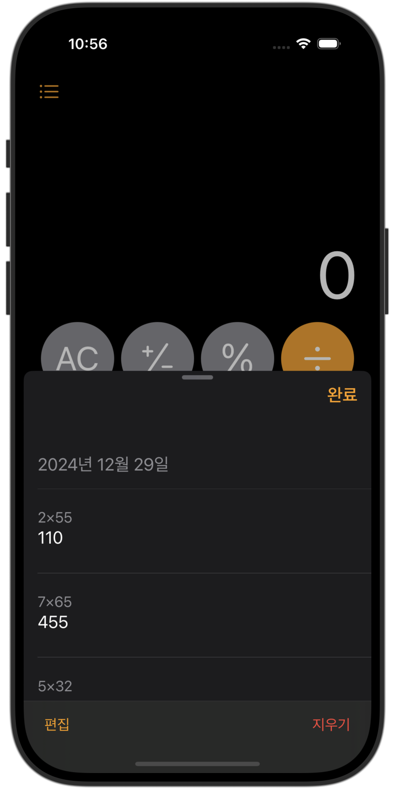

# SwiftUI_Calculator
SwiftUI로 애플 기본 계산기 앱을 구현

## 프로젝트 소개
- iOS 18에 기본 탑재된 계산기 앱을 SwiftUI로 프론트엔드, Swift로 백엔드를 구현

- **사용된 패턴**
    - MVVM

- **최소 iOS 버전**
    - iOS 16

## 앱 화면
<table>
  <tr>
    <td align="center" width="200">
      
      
<strong>일반 모드</strong>

    </td>
    <td align="center" width="200">
      
      
<strong>공학 모드</strong>

    </td>
  </tr>
  <tr>
    <td align="center" width="200">
      
      
<strong>모드 선택</strong>

    </td>
    <td align="center" width="200">
      
      
<strong>기록 열람 및 선택</strong>

    </td>
  </tr>
</table>
